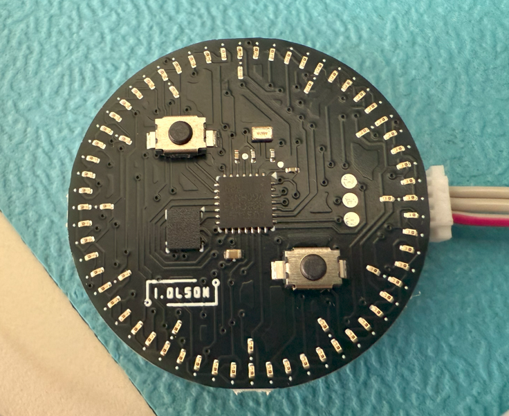

# Small Clock
Small analog style clock made with an STM32 and a 72 LED charlieplex, uses 0201 LED's.
Has 2 buttons and the LSM6DSO IMU as input.
Powered by a CR2032 battery, the battery life lasts about 2-3 days,
this is without any sleep state optimization. 
It is only 28mm in diameter.

